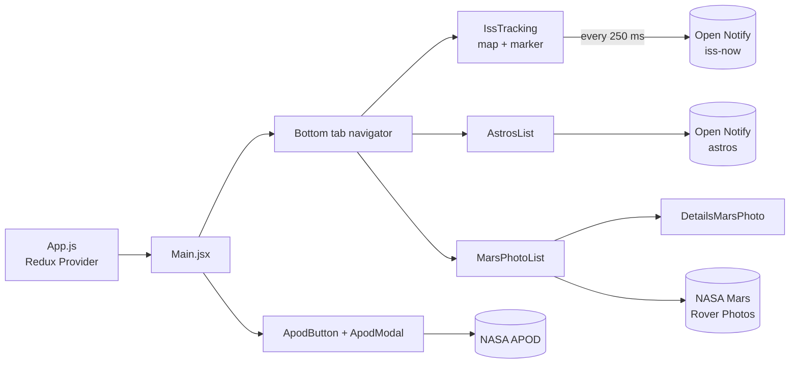

# ISS-Tracking-App

**Mobile app built with React Native and Expo that tracks the International Space Station in real time and shows space content from public APIs: people in space, Mars rover photos and NASA's Astronomy Picture of the Day.**


---

## Overview

The app has three tabs and a floating button:

| Section | What it shows | Data source |
|---|---|---|
| **ISS Real Time Tracking** | A map with the station's current position, updated continuously | [Open Notify](http://open-notify.org/) `iss-now.json` |
| **People on the ISS** | The list of people currently in space, each with a photo | Open Notify `astros.json` + local photo map (`src/data/astrosPhoto.json`) |
| **Mars Photo Rovers** | Photos taken by the Curiosity rover, with a details screen per photo | [NASA Mars Rover Photos API](https://api.nasa.gov/) |
| **APOD button** (floating) | A modal with NASA's Astronomy Picture of the Day: image, title, date, copyright and explanation | [NASA APOD API](https://api.nasa.gov/) |



## Features

- **Live ISS position:**
  - The map polls the ISS position every 250 ms and follows the station with a marker.
  - If you pan or zoom the map, auto-follow pauses and a **re-center** button appears to return to the station.
- **People in space:**
  - Cards with the name and photo of each person returned by Open Notify.
  - The photos come from a local map of names to image URLs.
- **Mars rover gallery:**
  - A list of Curiosity photos from Earth date **2015-06-03**.
  - Tapping **Information** stores the photo in Redux and opens a details screen with the sol, the date, the camera data and the rover data (landing and launch dates, status, max sol, total photos).
- **Astronomy Picture of the Day:** the floating button toggles a modal with today's APOD.
- **Loading states:** every screen shows a spinner until its API responds.

## Tech Stack

| Area | Technologies |
|---|---|
| Framework | React Native 0.73, Expo SDK 50, React 18 |
| Navigation | React Navigation 6 (bottom tabs + native stack) |
| State | Redux 5 + redux-thunk, react-redux |
| UI | React Native Paper, `@expo/vector-icons` |
| Maps | `react-native-maps` |
| APIs | Open Notify (ISS position, people in space), NASA APOD and Mars Rover Photos |

## Project Structure

```text
ISS-Tracking-App/
├── App.js                       # Redux Provider + SafeAreaProvider
├── app.json                     # Expo configuration
├── package.json
├── assets/                      # App icon, splash, favicon
└── src/
    ├── store.js                 # Redux store (thunk middleware)
    ├── components/
    │   ├── Main.jsx             # Navigation container, APOD modal and button
    │   ├── BottonTabNavigator.jsx
    │   ├── IssTracking.jsx      # Live map of the ISS
    │   ├── AstrosList.jsx       # People in space
    │   ├── MarsPhotoList.jsx    # Curiosity photo list
    │   ├── MarsPhotoItem.jsx
    │   ├── DetailsMarsPhoto.jsx
    │   ├── ApodButton.jsx
    │   ├── ApodModal.jsx
    │   └── LoadingIndicator.jsx
    ├── data/
    │   └── astrosPhoto.json     # Name → photo URL map for the astronauts
    └── redux/
        ├── types.js
        ├── actions/             # MarsPhoto, Apod
        └── reducers/            # MarsPhoto, Apod, index
```

## Getting Started

### Prerequisites

- Node.js and npm
- An Android or iOS device with **Expo Go**, or an Android emulator or iOS simulator

### Install and run

```bash
git clone https://github.com/nensanc/ISS-Tracking-App.git
cd ISS-Tracking-App
npm install
npm start            # expo start: scan the QR code with Expo Go
```

To open it straight on a device or emulator, use the other scripts:

```bash
npm run android      # expo start --android
npm run ios          # expo start --ios
```

### NASA API key

The NASA requests use the public `DEMO_KEY`, which has low rate limits. For regular use, get a free key at [api.nasa.gov](https://api.nasa.gov/) and replace `DEMO_KEY` in the request URLs in `src/components/ApodModal.jsx` and `src/components/MarsPhotoList.jsx`.

## Notes and Limitations

- **Expo Go and SDK 50:** the project targets Expo SDK 50. Expo Go only supports recent SDKs, so with a newer Expo Go you may need to upgrade the SDK or use a development build.
- **Web:** the `npm run web` script is defined, but the web dependencies (`react-dom`, `react-native-web`) aren't in `package.json`, and the map relies on `react-native-maps`.
- **Astronaut photos:** `astrosPhoto.json` only covers the 7 people who were in orbit when the app was built. If Open Notify returns a name that isn't in that file, the list can't find a photo for it.
- **APOD copyright:** the modal reads `data.copyright` directly. Some APOD entries are public domain and have no `copyright` field.
- **Fixed Mars date:** the rover gallery always queries Curiosity photos from 2015-06-03.
- **Unused dependencies:** `redux-logger` and `redux-promise-middleware` are listed in `package.json`, but the store only uses `redux-thunk`.

## Author

**Martin Sanchez** ([@nensanc](https://github.com/nensanc))
